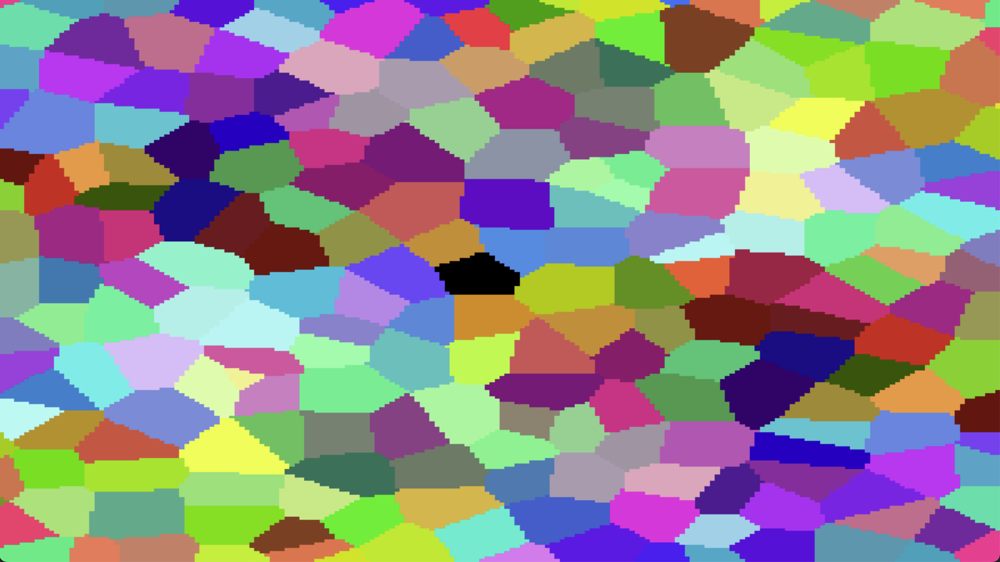

# DragonRuby Noise Library
A implementation of different noise functions for Dragon Ruby.
The noise functions work with standard DR but the example needs currently DR *Indie* or *Pro*.
Examples for DR standard are WIP.
If you want to report bugs, have improvements or want in generally talk about this project, visit [the official DragonRuby Discord](http://discord.dragonruby.org) and mention *@lyniat*.

# Examples
## Value Noise

## Cellular Noise

## Domain Warping

## Projects
[tiled render](https://github.com/owenbutler/tiled-render) by Owen Butler

# Performance
While trying to keep things fast, performance isn't the main goal of this project but the ease of use.
If you need some faster noise (and by faster I mean light speed like 🙃), I can totally recommend [Fast Noise Lite](https://github.com/Auburn/FastNoiseLite). (Keep in mind that *Fast Noise Lite* needs you to compile C/C++ code)

# License
See LICENSE file for more details.
Some code is taken/ported from [Fast Noise Lite](https://github.com/Auburn/FastNoiseLite) ([license](https://github.com/Auburn/FastNoiseLite/blob/master/LICENSE)) and [1D, 2D & 3D Value Noise](https://www.shadertoy.com/view/4dS3Wd) (BSD license).
